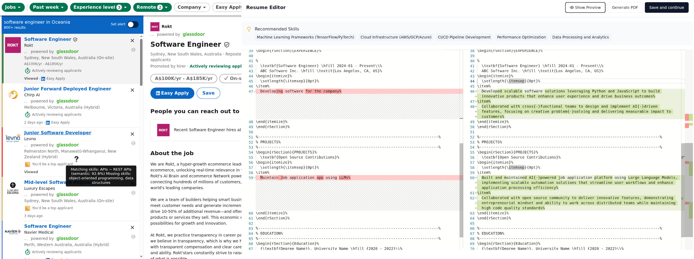

# 🚀 VettaVista - AI-Powered LinkedIn Job Application Assistant

Streamline your job search with intelligent filtering and AI-refined application materials.



## ✨ Why VettaVista?

- **🔍 User Control**: Review and edit all AI suggestions before using them
- **⚙️ Customizable**: Adapt AI prompts to your specific needs
- **🔄 Seamless Integration**: Works directly within LinkedIn's interface
- **📚 Learning Opportunity**: See how AI tailors your materials to each job
- **🔒 Privacy-Focused**: Runs entirely on your local machine - your data doesn't leave your computer (except for AI requests to Claude)

## 📋 About

VettaVista integrates directly with your browser to enhance your LinkedIn job search experience. It uses AI to intelligently filter job listings based on your preferences and helps you create tailored resumes and cover letters for each application. Everything runs locally on your machine, ensuring your data remains private.

## 📑 Table of Contents

- [Features](#-features)
    - [Smart, Two-Stage Filtering](#-smart-two-stage-filtering)
    - [Company Blacklisting](#-company-blacklisting)
    - [AI-Assisted Application Materials](#-ai-assisted-application-materials)
    - [Application Management](#-application-management)
- [Installation](#-installation)
    - [Requirements](#-requirements)
    - [Backend (Python Server)](#-backend-python-server)
    - [Frontend (Browser Extension)](#-frontend-browser-extension)
- [Usage](#-usage)
    - [Quick Start](#-quick-start)
    - [Job Filtering](#-job-filtering)
    - [Resume & Cover Letter Assistant](#-resume--cover-letter-assistant)
    - [Managing Applications](#-managing-applications)
- [Technical Overview](#-technical-overview)
- [Customization](#-customization)
- [Roadmap](#-roadmap)
- [Issues](#-issues)
- [License](#-license)
- [Disclaimer](#disclaimer)

## 🌟 Features

### 🔍 Smart, Two-Stage Filtering

- **⚡ Preliminary Filtering**: Quickly filter search results
    - Matches job titles using fuzzy search that understands similar terms
    - Detects listing languages to align with your language preferences
    - Leverages a small local LLM for quick, on-device assessment
    - Processes multiple listings simultaneously when scrolling down the list
- **🧠 Detailed Assessment**: In-depth evaluation using AI
    - Analyzes complete job descriptions and company information
    - Evaluates alignment with your experience and skills, including:
        - Title match
        - Required skills and experience
        - Number of years
        - Required languages
        - Company size
        - Visa requirements
        - General red flags
- **🎯 Visual Indicators**: See filtering results directly on LinkedIn job listings
- **👁️ Hide/Show Control**: Option to hide listings that don't match your criteria

### 🚫 Company Blacklisting

- Maintain a list of companies you're not interested in
- Automatically hide listings from blacklisted companies if hide listings is enabled
- Easily add/remove companies from the job listing page

### 📝 AI-Assisted Application Materials

- **📄 Resume Refinement**: Get AI suggestions to tailor your resume for each job
- **✉️ Cover Letter Creation**: Generate customized cover letters highlighting relevant experience
- **↔️ Side-by-Side Editing**: Compare original and AI-suggested versions while making edits
- **🖨️ PDF Generation**: Create PDFs of your application materials based on templates
- **📂 Organized Storage**: Save materials organized by job listing for easy reference and backup

### 📊 Application Management

- Track applied positions using CSV export
- Manage your job application status (WIP)
- Review the history of generated materials

## 💻 Installation

### ⚠️ Requirements

- Python 3.9 or higher
- Anthropic API key (See [here](https://docs.anthropic.com/en/docs/get-started) for how to get an API key)
- Chrome/Edge or Firefox browser

### 🐍 Backend (Python Server)

The package can be installed directly from PyPI:

```bash
python3 -m pip install vettavista-backend
```

#### Linux Dependencies

On Linux distributions, you may need to install Python development files:

- Debian/Ubuntu:
  ```bash
  sudo apt-get install python3-dev
  ```

- Fedora/RHEL/CentOS:
  ```bash
  sudo dnf install python3-devel
  ```

- Arch Linux:
  Python development headers are already included with the standard Python installation.

### 🧩 Frontend (Browser Extension)

*WIP: Chrome/Edge Web Store and Firefox Add-ons releases are being worked on.*

For now, the browser extension can be side-loaded:

**Chrome/Edge:**
1. Go to `chrome://extensions/` or `edge://extensions/`
2. Enable "Developer mode"
3. Click "Load unpacked"
4. Select the `Extension/dist` directory from the distributed files

**Firefox:**
1. Go to `about:debugging#/runtime/this-firefox`
2. Click "Load Temporary Add-on..."
3. Select any file in the `Extension/dist_ff` directory from the distributed files

## 🔰 Usage

### 🚀 Quick Start

For installation, see [Installation](#-installation)

1. Configure your Anthropic API key in the extension settings in `secrets.yaml`:
    - Windows:
   ```
   %USERPROFILE%\AppData\Local\VettaVista\{version}\local\secrets.yaml
   ```
    - macOS:
   ```
   ~/Library/Application Support/VettaVista/{version}/local/secrets.yaml
   ```
    - Linux:
   ```
   ~/.config/VettaVista/{version}/local\secrets.yaml
   ```
2. Set your job search preferences using YAML files under the following paths:
    - Windows:
   ```
   %USERPROFILE%\AppData\Local\VettaVista\{version}\local
   ```
    - macOS:
   ```
   ~/Library/Application Support/VettaVista/{version}/local
   ```
    - Linux:
   ```
   ~/.config/VettaVista/{version}/local
   ```
3. Start the Python server
   ```bash
   vettavista-backend
   ```

   The first start will take longer, as a few models need to be downloaded.
4. Browse LinkedIn jobs as usual - VettaVista will automatically start working!

### 🔍 Job Filtering

1. Browse LinkedIn job listings as you normally would
2. VettaVista will automatically use preliminary filtering to analyze and filter results
3. For detailed filtering, click on a specific job listing in the left column
4. Look for visual indicators on each job listing:
    - Green: Good match
    - Blue: Likely match
    - Yellow: Possible match
    - Coral: Unlikely match
    - Red: No match
5. Use the toggle in popup menu to show/hide filtered jobs

### 📝 Resume & Cover Letter Assistant

1. Click the "Apply" button in a job posting
2. The resume editor will open once AI has finished analyzing
3. Edit your resume in the side-by-side view. Use "Generate PDF" and "Preview" buttons to preview results
4. Once finished, click on the "Save" button to move on to cover letter
5. Similarly, edit and save the cover letter
6. Once finished, the folder containing the final files will open

### 📊 Managing Applications

1. Applied job data is exported to CSV for external tracking
2. Review previously generated materials (Default under `Documents`)

## ⚙️ Technical Overview

VettaVista consists of two main components:

1. **Frontend Browser Extension**: Integrates with LinkedIn's interface to display filtering results and provide editing tools
2. **Backend Python Server**: Runs locally to process job listings, communicate with AI services, and manage data storage

All communication happens locally on your machine. The only external communication is with Anthropic's API (using your own API key) for AI processing.

## 🛠️ Customization

VettaVista allows you to customize the AI prompts used for filtering and generating application materials:

1. Access the prompt settings in the YAML files (see [Quick Start](#quick-start))
2. Modify prompts to better match your specific needs and style
3. Save changes to see them take effect

Example use cases for customization:
- Adjust filtering criteria for specific industries
- Modify resume suggestion style for different career levels
- Customize cover letter tone and format
- Fine-tune matching algorithms to your preferences

## 🔮 Roadmap

Planned improvements include:

- Release on browser extension stores
- Additional AI model options
- User interface for editing filtering settings
- Enhanced job application management features
- Expanded customization capabilities
- Statistics and insights from your job search

## 🐛 Issues

If you encounter issues or have suggestions:

- [Open an issue on GitHub](#) (link to be added)

## 📜 License

See [LICENSE](LICENSE.md)

## Disclaimer

VettaVista is provided for educational and personal use only. This software is not affiliated with, endorsed by, or connected to LinkedIn or Anthropic in any way.

By using VettaVista, you agree to:
- Comply with LinkedIn's Terms of Service, including their policies regarding automated tools and data collection
- Adhere to Anthropic's Terms of Use when using their API services
- Use this software in a responsible and ethical manner

All LinkedIn trademarks, service marks, trade names, and logos are the property of LinkedIn Corporation. All Anthropic trademarks, service marks, trade names, and logos are the property of Anthropic PBC.

The creators and contributors of VettaVista accept no responsibility or liability for any damages, losses, or legal consequences that may arise from the use or misuse of this software. You use VettaVista entirely at your own risk.

This disclaimer may be updated without prior notice. It is your responsibility to review it periodically for changes.
